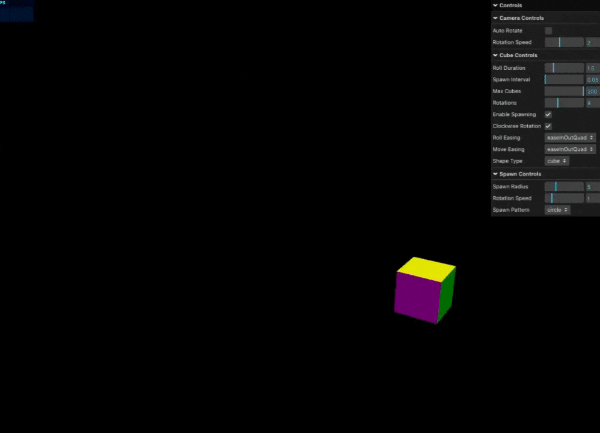

# Dynamic 3D Shape Animation System


An interactive WebGL-based 3D shape animation system built with Three.js and Next.js. This project showcases dynamic shape generation, complex spawn patterns, and customizable animations with an intuitive GUI control system.



## 🌟 Features

### 3D Shapes (8 Types)
- Platonic Solids
  - Cube
  - Tetrahedron
  - Octahedron
  - Dodecahedron
  - Icosahedron
- Curved Surfaces
  - Sphere
  - Torus
  - Capsule

### Spawn Patterns (10 Types)
- Circle
- Spiral
- Flower
- Star
- Heart
- Square
- Infinity
- Lemniscate
- Triangle
- Random

### Animation Controls
- 21 Easing Functions
- Customizable Parameters
  - Spawn Interval (0.05-2.0s)
  - Rotation Direction
  - Maximum Shape Count (1-200)
  - Roll Duration
  - Spawn Radius

## 🚀 Getting Started

### Prerequisites
- Node.js 18.0.0 or higher
- npm or yarn

### Installation

1. Clone the repository
```bash
git clone https://github.com/harukaapps/3d-shape-animation.git
cd 3d-shape-animation
```

2. Install dependencies
```bash
npm install
# or
yarn install
```

3. Start the development server
```bash
npm run dev
# or
yarn dev
```

4. Open [http://localhost:3000](http://localhost:3000) in your browser

## 🎮 Usage

1. Use the GUI controls on the right side of the screen to:
   - Select shape types
   - Choose spawn patterns
   - Adjust animation parameters
   - Control camera settings

2. Interact with the 3D scene:
   - Left click and drag to rotate
   - Right click and drag to pan
   - Scroll to zoom

## 🛠 Technical Details

### Built With
- [Three.js](https://threejs.org/) - 3D Graphics Library
- [Next.js](https://nextjs.org/) - React Framework
- [TypeScript](https://www.typescriptlang.org/) - Type Safety
- [lil-gui](https://lil-gui.georgealways.com/) - GUI Controls

### Performance Optimizations
- Efficient object pooling
- Automatic garbage collection
- Optimized rendering cycles
- Memory leak prevention

## 📝 License

This project is licensed under the MIT License - see the [LICENSE](LICENSE) file for details.

## 📧 Contact

haruka_apps - [@harukaapps](https://github.com/harukaapps)

Project Link: [https://github.com/harukaapps/3d-shape-animation](https://github.com/harukaapps/3d-shape-animation)
