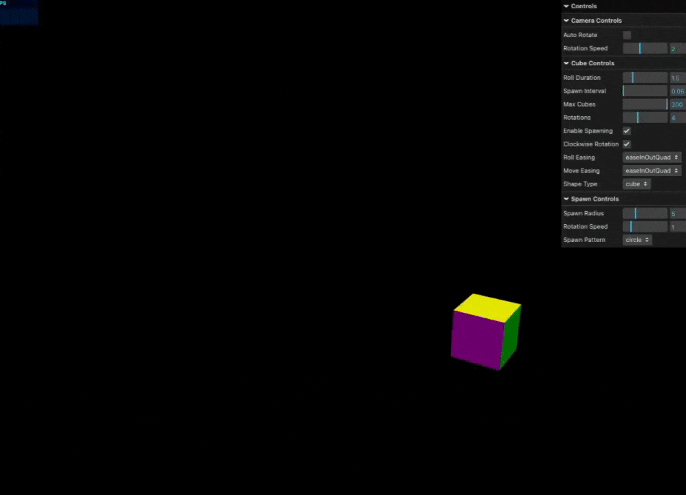

# Dynamic 3D Shape Animation System Documentation

## Overview

This documentation provides detailed information about the Dynamic 3D Shape Animation System, its features, and implementation details.

## Table of Contents

1. [Shape Types](#shape-types)
2. [Spawn Patterns](#spawn-patterns)
3. [Animation System](#animation-system)
4. [Controls](#controls)
5. [Technical Implementation](#technical-implementation)

## Shape Types

### Platonic Solids

1. **Cube**
   - Regular hexahedron
   - 6 square faces
   - Default shape type

2. **Tetrahedron**
   - Regular triangular pyramid
   - 4 triangular faces

3. **Octahedron**
   - 8 triangular faces
   - Dual polyhedron of the cube

4. **Dodecahedron**
   - 12 pentagonal faces
   - One of the most complex Platonic solids

5. **Icosahedron**
   - 20 triangular faces
   - Most sphere-like of the Platonic solids

### Curved Surfaces

6. **Sphere**
   - Perfect spherical shape
   - Smooth surface
   - Configurable segments

7. **Torus**
   - Donut shape
   - Configurable radius and tube
   - Smooth curved surface

8. **Capsule**
   - Cylinder with hemispheres at ends
   - Smooth transitions
   - Pill-like shape

## Spawn Patterns

### Basic Patterns

1. **Circle**
   - Uniform distribution around a circle
   - Configurable radius
   - Smooth circular placement

2. **Square**
   - Grid-like pattern
   - Even spacing
   - Rectangular boundary

3. **Triangle**
   - Triangular formation
   - Symmetric distribution
   - Three-sided pattern

### Complex Patterns

4. **Spiral**
   - Logarithmic spiral pattern
   - Increasing radius
   - Smooth curve distribution

5. **Flower**
   - Petal-like arrangement
   - Radial symmetry
   - Natural-looking pattern

6. **Star**
   - Star-shaped pattern
   - Points radiating outward
   - Symmetric distribution

7. **Heart**
   - Heart-shaped curve
   - Smooth transitions
   - Artistic pattern

8. **Infinity**
   - Figure-eight pattern
   - Continuous loop
   - Smooth curves

9. **Lemniscate**
   - Mathematical curve
   - Figure-eight variant
   - Smooth transitions

10. **Random**
    - Random distribution
    - Unpredictable patterns
    - Chaotic arrangement

## Animation System

### Easing Functions

The system includes 21 different easing functions for smooth animations:

1. **Linear**
   - Constant speed
   - No acceleration

2. **Quadratic**
   - In
   - Out
   - InOut

3. **Cubic**
   - In
   - Out
   - InOut

4. **Quartic**
   - In
   - Out
   - InOut

5. **Quintic**
   - In
   - Out
   - InOut

6. **Sinusoidal**
   - In
   - Out
   - InOut

7. **Exponential**
   - In
   - Out
   - InOut

8. **Circular**
   - In
   - Out
   - InOut

### Animation Parameters

- **Spawn Interval**: 0.05s - 2.0s
- **Roll Duration**: Controls animation length
- **Rotation Count**: Number of complete rotations
- **Direction**: Clockwise/Counterclockwise

## Controls

### GUI Controls

The system provides an intuitive GUI with the following controls:

1. **Shape Selection**
   - Dropdown menu for shape types
   - Real-time shape switching
   - Preview capability

2. **Pattern Controls**
   - Pattern selection
   - Radius adjustment
   - Speed control

3. **Animation Settings**
   - Easing function selection
   - Duration control
   - Direction toggle

4. **Camera Controls**
   - Rotation speed
   - Auto-rotation toggle
   - View angle adjustment

### Mouse/Touch Controls

1. **Rotation**
   - Left click/touch and drag
   - Smooth orbital rotation
   - Momentum support

2. **Pan**
   - Right click/touch and drag
   - Smooth panning
   - Boundary limits

3. **Zoom**
   - Mouse wheel/pinch gesture
   - Smooth zooming
   - Min/max limits

## Technical Implementation

### Performance Optimizations

1. **Object Pooling**
   - Reuse of geometry
   - Memory efficiency
   - Reduced garbage collection

2. **Render Optimization**
   - RequestAnimationFrame usage
   - Frame rate optimization
   - Efficient scene updates

3. **Memory Management**
   - Proper disposal of objects
   - Texture memory management
   - Scene cleanup

### WebGL Features

1. **Lighting**
   - Ambient light
   - Directional light
   - Shadow mapping

2. **Materials**
   - PBR materials
   - Custom shaders
   - Optimized textures

3. **Scene Management**
   - Efficient scene graph
   - Frustum culling
   - Level of detail
